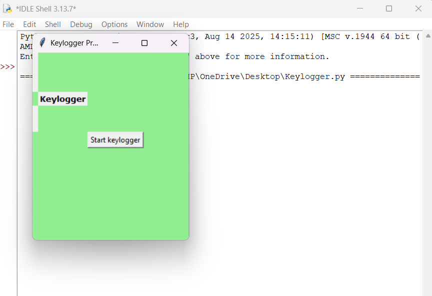

# 🔐 Keylogger – Capturing Keystrokes with GUI

A Python-based Keylogger application that captures keystrokes and stores them in a log file using a simple Graphical User Interface (GUI).

> ⚠️ This project is created strictly for **educational and ethical learning purposes only**.

---

## 📌 Features
- GUI based application using Tkinter  
- Captures keyboard strokes in background  
- Stores keystrokes securely in JSON file  
- Start / Stop logging functionality  
- Lightweight and beginner friendly project  

---

## 🛠 Technologies Used
- Python  
- Tkinter (GUI)  
- Pynput (Keyboard Listener)  
- JSON File Handling  

---

## 📸 Project Output

---
👥 End Users

Cybersecurity learners

Python beginners

Ethical hacking students

System security researchers

📄 Project Description

This application demonstrates how keystroke capturing works internally for learning system security concepts. It records pressed keys and stores them into a log file using Python.

